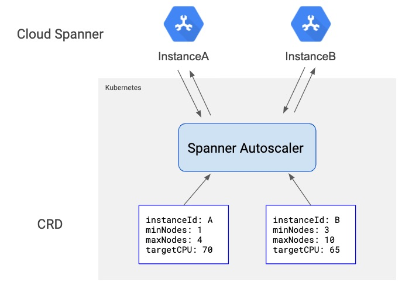
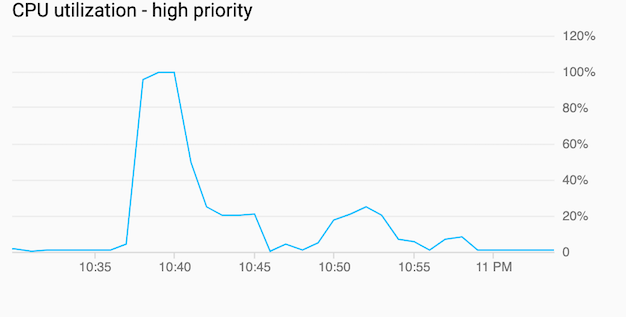
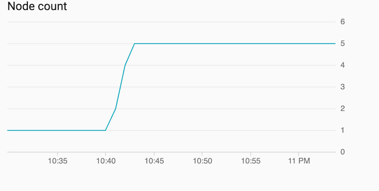
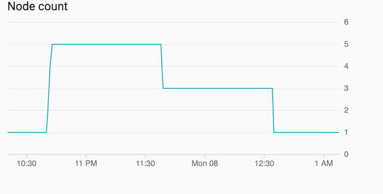

# Spanner Autoscaler

[![actions-workflow-test][actions-workflow-test-badge]][actions-workflow-test]
[![release][release-badge]][release]
[![license][license-badge]][license]

Spanner Autoscaler is a [Kubernetes Operator](https://coreos.com/operators/) to scale [Google Cloud Spanner](https://cloud.google.com/spanner/) automatically based on Cloud Spanner Instance CPU utilization like [Horizontal Pod Autoscaler](https://kubernetes.io/docs/tasks/run-application/horizontal-pod-autoscale/).

## Status

**This is an experimental project. DO NOT use this in production.**

1. Spanner Autoscaler is not tested on our production yet.
2. Spanner Autoscaler watches `High Priority` CPU utilization only. It doesn't watch `Low Priority` CPU utilization and Rolling average 24 hour utilization.
It doesn't check the storage size as well. You must take care of these metrics by yourself.

## Overview

[Cloud Spanner](https://cloud.google.com/spanner) is scalable.
When CPU utilization gets high, we can [reduce CPU utilization by adding new nodes](https://cloud.google.com/spanner/docs/cpu-utilization#reduce).

Spanner Autoscaler is created to reconcile Cloud Spanner nodes like [Horizontal Pod Autoscaler](https://kubernetes.io/docs/tasks/run-application/horizontal-pod-autoscale/) by configuring `minNodes`, `maxNodes`, and `targetCPUUtilization`.



When CPU Utilization(High Priority) is above `taregetCPUUtilization`, Spanner Autoscaler calcurates desired nodes count and increase nodes.





After CPU Utilization gets low, Spanner Autoscaler *doesn't* decrease nodes count immediately.



Spanner Autoscaler has `Scale Down Interval`(default: 55min) and `Max Scale Down Nodes`(default: 2) to scale down nodes.
The [pricing of Cloud Spanner](https://cloud.google.com/spanner/pricing) says any nodes that you provision will be billed for a minimum of one hour, so it keep nodes up around 1 hour.
And if Spanner Autoscaler reduces a lot of nodes at once like 10 -> 1, it will cause a latency increase. It reduces nodes with `maxScaleDownNodes`.

## Prerequisite

Enable APIs `spanner.googleapis.com` and `serviceusage.googleapis.com` on your GCP project.

## Installation

The installation has 3 steps:

1. Installation of CRD
2. Deployment of the operator
3. Create Custom Resource

### 1. Install CRD

```
$ make install
```

### 2. Deploy operator to cluster

```
$ make deploy
```

### 3. Create Custom Resource

```
$ kubectl apply -f config/samples/spanner_v1alpha1_spannerautoscaler.yaml
```

### KPT

Spanner Autoscaler can be installed using [KPT](https://github.com/GoogleContainerTools/kpt).
The installation has 2 steps:

1. Fetch package
2. Create Custom Resource

#### 1. Fetch package

```
$ mkdir tmp
$ kpt pkg get https://github.com/mercari/spanner-autoscaler tmp/
```

#### 2. Create Custom Resource

```
$ kubectl apply -R -f tmp/kpt
```

## Configuration

After installing Spanner Autoscaler, some configuration is required to use it for your Cloud Spanner Instance.

### 1. Prepare a GCP Service Account for Spanner Autoscaler.

1. Create a [GCP service account](https://cloud.google.com/iam/docs/service-accounts) for Spanner Autoscaler with `roles/spanner.admin` and `roles/monitoring.viewer`.
2. Create json key for the service account created step 1.
3. Create Kubernetes Secret for the service account like below:

    ```sh
    > kubectl create secret generic spanner-autoscaler-service-account --from-file=service-account=./service-account-key.json -n your-namespace
    ```

### 2. Create Kubernetes Role and RoleBinding to read the secret

Add Role and RoleBinding to allow Spanner Autoscaler to read the service account secret like below:

```yaml
---
apiVersion: rbac.authorization.k8s.io/v1
kind: Role
metadata:
  namespace: your-namespace
  name: spanner-autoscaler-service-account-reader
rules:
  - apiGroups: [""]
    resources: ["secrets"]
    verbs: ["get"]
    resourceNames: ["spanner-autoscaler-service-account"]

---
apiVersion: rbac.authorization.k8s.io/v1
kind: RoleBinding
metadata:
  namespace: your-namespace
  name: spanner-autoscaler-service-account-reader
roleRef:
  apiGroup: rbac.authorization.k8s.io
  kind: Role
  name: spanner-autoscaler-service-account-reader
subjects:
  - kind: ServiceAccount
    name: default
    namespace: spanner-autoscaler
```

### 3. Create Kubernetes Role and RoleBinding for publish events

Add Role and RoleBinding to allow Spanner Autoscaler publish Events like below:

```yaml
---
apiVersion: rbac.authorization.k8s.io/v1
kind: Role
metadata:
  namespace: your-namespace
  name: spanner-autoscaler-event-publisher
rules:
  - apiGroups: [""]
    resources: ["events"]
    verbs: ["create", "patch"]

---
apiVersion: rbac.authorization.k8s.io/v1
kind: RoleBinding
metadata:
  namespace: your-namespace
  name: spanner-autoscaler-event-publisher
roleRef:
  apiGroup: rbac.authorization.k8s.io
  kind: Role
  name: spanner-autoscaler-event-publisher
subjects:
  - kind: ServiceAccount
    name: default
    namespace: spanner-autoscaler
```

### 4. Create SpannerAutoscaler resource

You need to configure following items

* `scaleTargetRef`: Target Project and Cloud Spanner Instance
  * `projectId`: GCP Project ID
  * `instanceId`: Cloud Spanner Instance ID
* `serviceAccountSecretRef`: Secret which you created on 1. Step
* `minNodes`: Minimum number of Cloud Spanner nodes.
* `maxNodes`: Maximum number of Cloud Spanner nodes. It should be higher than `minNodes` and not over [quota](https://cloud.google.com/spanner/quotas).
* `maxScaleDownNodes`(optional): Maximum number of nodes scale down at once. Default is 2.
* `targetCPUUtilization`: Spanner Autoscaler watches `High Priority` CPU utilization for now. Please read [CPU utilization metrics  \|  Cloud Spanner](https://cloud.google.com/spanner/docs/cpu-utilization) and configure target CPU utilization.

Example yaml:

```yaml
---
apiVersion: spanner.mercari.com/v1alpha1
kind: SpannerAutoscaler
metadata:
  name: spannerautoscaler-sample
  namespace: your-namespace
spec:
  scaleTargetRef:
    projectId: your-gcp-project-id
    instanceId: your-spanner-instance-id
  serviceAccountSecretRef:
    namespace: your-namespace
    name: spanner-autoscaler-service-account
    key: service-account
  minNodes: 1
  maxNodes: 4
  maxScaleDownNodes: 1
  targetCPUUtilization:
    highPriority: 60
```

## CRD

See [example](./config/samples/spanner-autoscaler.yaml) and [crd](./config/crd/bases/spanner.mercari.com_spannerautoscalers.yaml).

## Development

### Test operator

```
$ make test
```

## Contribution

See [CONTRIBUTING.md](CONTRIBUTING.md).

## License

Spanner Autoscaler is released under the [Apache License 2.0](./LICENSE).

<!-- badge links -->

[actions-workflow-test]: https://github.com/mercari/spanner-autoscaler/actions?query=workflow%3ATest
[actions-workflow-test-badge]: https://img.shields.io/github/workflow/status/mercari/spanner-autoscaler/Test?label=Test&style=for-the-badge&logo=github

[release]: https://github.com/mercari/spanner-autoscaler/releases
[release-badge]: https://img.shields.io/github/v/release/mercari/spanner-autoscaler?style=for-the-badge&logo=github

[license]: LICENSE
[license-badge]: https://img.shields.io/github/license/mercari/spanner-autoscaler?style=for-the-badge
